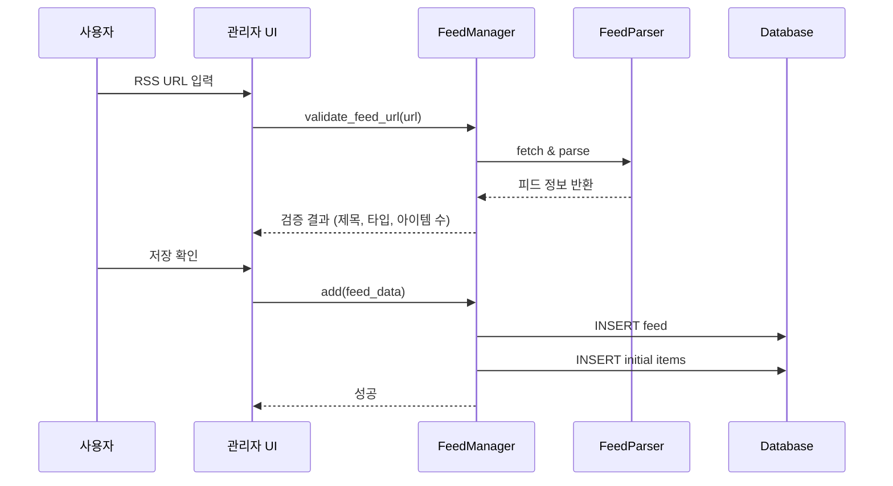
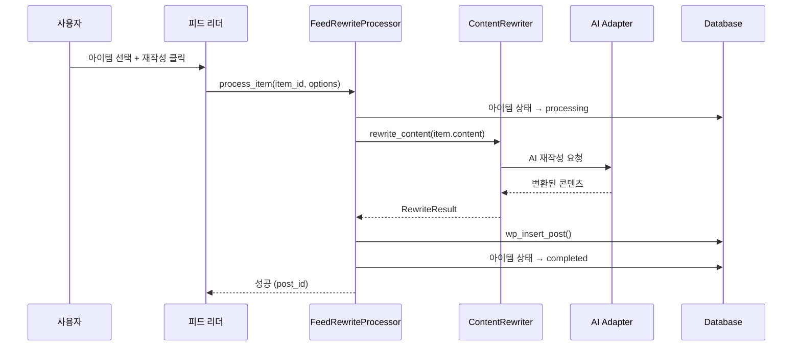
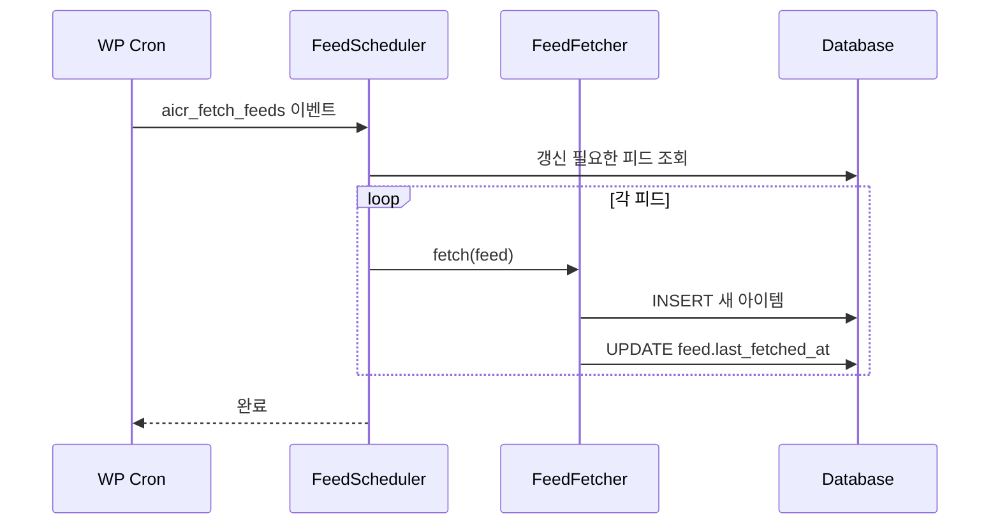

# RSS 구독 기능 설계 문서

> **버전**: 1.0
> **작성일**: 2025-12-29
> **상태**: 설계 완료, 구현 대기

---

## 1. 개요

### 1.1 기능 목적
외부 블로그의 RSS 피드를 구독하고, 새로운 게시글이 발행되면 기존 AI 재작성 기능을 활용하여 자동 또는 수동으로 콘텐츠를 변환하여 내 블로그에 게시하는 기능.

### 1.2 주요 사용 사례
1. **콘텐츠 큐레이션**: 관심 있는 블로그의 글을 수집하여 나만의 관점으로 재작성
2. **다국어 콘텐츠**: 영문 블로그 구독 후 한국어로 번역/재작성하여 게시
3. **자동화 파이프라인**: 특정 피드의 새 글을 자동으로 수집 → AI 변환 → 게시

### 1.3 핵심 가치
- 수동 URL 입력 없이 피드 기반 콘텐츠 수집
- 읽지 않은/새로운 글 추적
- 기존 AI 재작성 인프라 100% 활용
- WordPress Cron과 연동한 자동화 지원

---

## 2. 기능 요구사항

### 2.1 RSS 피드 관리 (CRUD)
| 기능 | 설명 | 우선순위 |
|------|------|----------|
| 피드 등록 | RSS/Atom URL 입력으로 피드 추가 | 필수 |
| 피드 검증 | URL 유효성 및 피드 형식 검증 | 필수 |
| 피드 목록 | 등록된 피드 목록 조회 | 필수 |
| 피드 편집 | 이름, 카테고리 매핑 등 수정 | 필수 |
| 피드 삭제 | 피드 및 관련 아이템 삭제 | 필수 |
| 피드 활성화/비활성화 | 수집 일시 중지 | 필수 |

### 2.2 피드 아이템 수집
| 기능 | 설명 | 우선순위 |
|------|------|----------|
| 수동 새로고침 | 즉시 피드 갱신 | 필수 |
| 자동 새로고침 | Cron 기반 주기적 갱신 | 필수 |
| 중복 방지 | GUID 기반 중복 아이템 스킵 | 필수 |
| 상태 추적 | 읽음/안읽음, 처리됨/대기 | 필수 |
| 메타데이터 저장 | 발행일, 작성자, 카테고리 등 | 필수 |

### 2.3 피드 리더 UI
| 기능 | 설명 | 우선순위 |
|------|------|----------|
| 아이템 목록 | 수집된 게시글 목록 표시 | 필수 |
| 피드별 필터 | 특정 피드의 글만 보기 | 필수 |
| 상태별 필터 | 읽음/안읽음, 처리됨 필터 | 필수 |
| 미리보기 | 원본 콘텐츠 간략 미리보기 | 필수 |
| 다중 선택 | 여러 아이템 일괄 선택 | 권장 |
| 원본 링크 | 원본 글로 이동 | 필수 |

### 2.4 AI 재작성 연동
| 기능 | 설명 | 우선순위 |
|------|------|----------|
| 단일 재작성 | 선택한 아이템 AI 변환 | 필수 |
| 일괄 재작성 | 다중 선택 후 큐에 추가 | 권장 |
| 템플릿 선택 | 재작성 프롬프트 선택 | 필수 |
| 미리보기 | 변환 결과 확인 후 게시 | 필수 |
| 즉시 게시 | 재작성 후 바로 게시 | 필수 |
| 초안 저장 | 재작성 후 초안으로 저장 | 필수 |

### 2.5 자동화 옵션
| 기능 | 설명 | 우선순위 |
|------|------|----------|
| 자동 재작성 | 새 아이템 자동 AI 처리 | 선택 |
| 자동 게시 | 처리 완료 후 자동 게시 | 선택 |
| 필터 규칙 | 키워드 기반 자동 처리 대상 | 선택 |

---

## 3. 데이터베이스 설계

### 3.1 테이블: `wp_aicr_feeds`
RSS 피드 정보 저장

```sql
CREATE TABLE wp_aicr_feeds (
    id BIGINT(20) UNSIGNED NOT NULL AUTO_INCREMENT,
    user_id BIGINT(20) UNSIGNED NOT NULL,
    name VARCHAR(255) NOT NULL,
    feed_url VARCHAR(2048) NOT NULL,
    site_url VARCHAR(2048) DEFAULT NULL,
    site_name VARCHAR(255) DEFAULT NULL,
    feed_type ENUM('rss', 'atom', 'rss2') DEFAULT 'rss2',
    status ENUM('active', 'paused', 'error') DEFAULT 'active',
    last_fetched_at DATETIME DEFAULT NULL,
    last_error VARCHAR(500) DEFAULT NULL,
    fetch_interval INT DEFAULT 3600,          -- 갱신 주기 (초)
    auto_rewrite TINYINT(1) DEFAULT 0,        -- 자동 재작성 여부
    auto_publish TINYINT(1) DEFAULT 0,        -- 자동 게시 여부
    default_category BIGINT(20) UNSIGNED DEFAULT NULL,
    default_template_id BIGINT(20) UNSIGNED DEFAULT NULL,
    metadata JSON DEFAULT NULL,
    created_at DATETIME DEFAULT CURRENT_TIMESTAMP,
    updated_at DATETIME DEFAULT CURRENT_TIMESTAMP ON UPDATE CURRENT_TIMESTAMP,
    PRIMARY KEY (id),
    INDEX idx_user_status (user_id, status),
    INDEX idx_last_fetched (last_fetched_at)
) ENGINE=InnoDB DEFAULT CHARSET=utf8mb4;
```

### 3.2 테이블: `wp_aicr_feed_items`
피드에서 수집된 개별 아이템

```sql
CREATE TABLE wp_aicr_feed_items (
    id BIGINT(20) UNSIGNED NOT NULL AUTO_INCREMENT,
    feed_id BIGINT(20) UNSIGNED NOT NULL,
    guid VARCHAR(255) NOT NULL,               -- 아이템 고유 ID (중복 방지)
    title VARCHAR(500) NOT NULL,
    link VARCHAR(2048) NOT NULL,
    content LONGTEXT DEFAULT NULL,
    summary TEXT DEFAULT NULL,
    author VARCHAR(255) DEFAULT NULL,
    pub_date DATETIME DEFAULT NULL,
    categories JSON DEFAULT NULL,             -- 원본 카테고리
    enclosures JSON DEFAULT NULL,             -- 첨부파일/미디어
    status ENUM('unread', 'read', 'queued', 'processing', 'completed', 'skipped', 'failed') DEFAULT 'unread',
    rewritten_post_id BIGINT(20) UNSIGNED DEFAULT NULL,  -- 생성된 WP 게시글 ID
    error_message VARCHAR(500) DEFAULT NULL,
    metadata JSON DEFAULT NULL,
    fetched_at DATETIME DEFAULT CURRENT_TIMESTAMP,
    processed_at DATETIME DEFAULT NULL,
    PRIMARY KEY (id),
    UNIQUE KEY uk_feed_guid (feed_id, guid),
    INDEX idx_feed_status (feed_id, status),
    INDEX idx_pub_date (pub_date DESC),
    FOREIGN KEY (feed_id) REFERENCES wp_aicr_feeds(id) ON DELETE CASCADE
) ENGINE=InnoDB DEFAULT CHARSET=utf8mb4;
```

### 3.3 ERD 다이어그램

```
┌─────────────────────┐       ┌─────────────────────────┐
│    wp_aicr_feeds    │       │   wp_aicr_feed_items    │
├─────────────────────┤       ├─────────────────────────┤
│ id (PK)             │──────<│ feed_id (FK)            │
│ user_id             │       │ id (PK)                 │
│ name                │       │ guid                    │
│ feed_url            │       │ title                   │
│ status              │       │ link                    │
│ auto_rewrite        │       │ content                 │
│ default_template_id │       │ status                  │
│ ...                 │       │ rewritten_post_id ──────┼──> wp_posts
└─────────────────────┘       └─────────────────────────┘
          │
          │ default_template_id
          ▼
┌─────────────────────┐
│  wp_aicr_templates  │
│     (기존 테이블)    │
└─────────────────────┘
```

---

## 4. 클래스 설계

### 4.1 디렉토리 구조

```
src/
├── RSS/
│   ├── FeedManager.php          # 피드 CRUD 관리
│   ├── FeedFetcher.php          # 피드 가져오기/파싱
│   ├── FeedParser.php           # RSS/Atom 파싱
│   ├── FeedItem.php             # 아이템 엔티티
│   ├── FeedItemRepository.php   # 아이템 DB 접근
│   ├── FeedScheduler.php        # 자동 갱신 스케줄러
│   └── FeedRewriteProcessor.php # 재작성 연동 처리
├── Admin/
│   ├── views/
│   │   ├── feeds.php            # 피드 관리 페이지
│   │   └── feed-reader.php      # 피드 리더 페이지
│   └── AjaxHandler.php          # (기존, RSS 핸들러 추가)
└── ...
```

### 4.2 핵심 클래스

#### FeedManager
```php
class FeedManager {
    public function add(array $data): int;
    public function update(int $id, array $data): bool;
    public function delete(int $id): bool;
    public function get(int $id): ?Feed;
    public function get_all(int $user_id, array $filters = []): array;
    public function toggle_status(int $id): bool;
    public function validate_feed_url(string $url): array;
}
```

#### FeedFetcher
```php
class FeedFetcher {
    public function fetch(Feed $feed): FetchResult;
    public function fetch_all_due(): array;
    public function mark_as_fetched(int $feed_id): void;
}
```

#### FeedParser
```php
class FeedParser {
    public function parse(string $xml): ParsedFeed;
    public function detect_feed_type(string $xml): string;
    public function extract_items(ParsedFeed $feed): array;
}
```

#### FeedRewriteProcessor
```php
class FeedRewriteProcessor {
    public function queue_item(int $item_id, array $options = []): void;
    public function process_item(int $item_id): RewriteResult;
    public function process_batch(array $item_ids): array;
}
```

---

## 5. UI/UX 설계

### 5.1 메뉴 구조 변경

```
AI Rewriter (기존)
├── 새 콘텐츠
├── RSS 피드 ──────── [신규] 피드 관리
├── 피드 리더 ─────── [신규] 수집된 글 목록
├── 히스토리
├── 스케줄
├── 템플릿
└── 설정
```

### 5.2 RSS 피드 관리 페이지

```
┌─────────────────────────────────────────────────────────────┐
│ RSS 피드 관리                              [새 피드 추가]   │
├─────────────────────────────────────────────────────────────┤
│ ┌─────────────────────────────────────────────────────────┐ │
│ │ 🔄 TechCrunch                          활성 ⚫ │ 편집 삭제 │ │
│ │    https://techcrunch.com/feed/                        │ │
│ │    마지막 갱신: 10분 전 | 아이템: 45개 | 미읽음: 12개   │ │
│ └─────────────────────────────────────────────────────────┘ │
│ ┌─────────────────────────────────────────────────────────┐ │
│ │ 📡 Smashing Magazine                   활성 ⚫ │ 편집 삭제 │ │
│ │    https://www.smashingmagazine.com/feed/              │ │
│ │    마지막 갱신: 1시간 전 | 아이템: 32개 | 미읽음: 5개   │ │
│ └─────────────────────────────────────────────────────────┘ │
│ ┌─────────────────────────────────────────────────────────┐ │
│ │ ⏸️ CSS-Tricks                         일시정지 ⚪ │ 편집 삭제 │ │
│ │    https://css-tricks.com/feed/                        │ │
│ │    마지막 갱신: 3일 전 | 아이템: 28개 | 미읽음: 0개     │ │
│ └─────────────────────────────────────────────────────────┘ │
└─────────────────────────────────────────────────────────────┘
```

### 5.3 피드 리더 페이지

```
┌─────────────────────────────────────────────────────────────────────┐
│ 피드 리더                                                           │
├──────────────────┬──────────────────────────────────────────────────┤
│ 필터              │ 아이템 목록                                      │
│ ┌──────────────┐ │ ┌──────────────────────────────────────────────┐ │
│ │ 모든 피드    │ │ │ ☐ □ The Future of AI in 2025                │ │
│ │ ├─ TechCrunch│ │ │   TechCrunch • 2시간 전                      │ │
│ │ ├─ Smashing  │ │ │   AI technology continues to evolve...      │ │
│ │ └─ CSS-Tricks│ │ │   [미리보기] [재작성] [원본보기]              │ │
│ ├──────────────┤ │ ├──────────────────────────────────────────────┤ │
│ │ 상태         │ │ │ ☐ ● How to Build Better Components          │ │
│ │ ○ 전체       │ │ │   Smashing Magazine • 5시간 전               │ │
│ │ ● 미읽음 (17)│ │ │   Component-driven development is...        │ │
│ │ ○ 읽음       │ │ │   [미리보기] [재작성] [원본보기]              │ │
│ │ ○ 처리됨     │ │ ├──────────────────────────────────────────────┤ │
│ │ ○ 대기중     │ │ │ ☐ □ CSS Grid Layout Complete Guide          │ │
│ └──────────────┘ │ │   CSS-Tricks • 1일 전                        │ │
│                  │ │   Learn everything about CSS Grid...        │ │
│ [선택된 항목]    │ │   [미리보기] [재작성] [원본보기]              │ │
│ 3개 선택됨       │ └──────────────────────────────────────────────┘ │
│ [일괄 재작성]    │                                                  │
│ [읽음 처리]      │ ◀ 1  2  3  4  5 ▶                              │
│ [건너뛰기]       │                                                  │
└──────────────────┴──────────────────────────────────────────────────┘
```

### 5.4 재작성 모달

```
┌─────────────────────────────────────────────────────────────┐
│ RSS 아이템 재작성                                      [X]  │
├─────────────────────────────────────────────────────────────┤
│                                                             │
│ 원본 제목: The Future of AI in 2025                        │
│ 출처: TechCrunch (https://techcrunch.com/...)               │
│ 발행일: 2025-12-29                                          │
│                                                             │
│ ┌─────────────────────────────────────────────────────────┐ │
│ │ AI 모델          │ ▼ ChatGPT-5                          │ │
│ ├─────────────────────────────────────────────────────────┤ │
│ │ 프롬프트 템플릿  │ ▼ 콘텐츠 재작성 (기본)                │ │
│ ├─────────────────────────────────────────────────────────┤ │
│ │ 대상 언어        │ ▼ 한국어                              │ │
│ ├─────────────────────────────────────────────────────────┤ │
│ │ 카테고리         │ ▼ 기술                                │ │
│ ├─────────────────────────────────────────────────────────┤ │
│ │ 게시 상태        │ ○ 초안  ● 바로 게시                   │ │
│ └─────────────────────────────────────────────────────────┘ │
│                                                             │
│        [취소]                      [재작성 시작]            │
│                                                             │
└─────────────────────────────────────────────────────────────┘
```

---

## 6. 워크플로우

### 6.1 피드 등록 플로우



### 6.2 아이템 재작성 플로우



### 6.3 자동 갱신 플로우 (Cron)



---

## 7. 기존 시스템 연동

### 7.1 재사용 컴포넌트

| 기존 컴포넌트 | 재사용 방식 |
|--------------|-------------|
| `ContentRewriter` | RSS 아이템 본문 재작성 |
| `ContentExtractor` | 원본 URL에서 추가 콘텐츠 추출 (옵션) |
| `AIFactory` | ChatGPT/Gemini 어댑터 선택 |
| `PromptManager` | 재작성 템플릿 선택 |
| `RewriteResult` | 결과 DTO 동일 사용 |
| `Scheduler` | Cron 이벤트 등록 확장 |

### 7.2 설정 페이지 확장

설정 > RSS 탭 추가:
- 기본 갱신 주기
- 자동 재작성 글로벌 설정
- 피드당 최대 아이템 수
- 아이템 보관 기간

---

## 8. 보안 고려사항

### 8.1 입력 검증
- RSS URL: `esc_url_raw()`, SSRF 방지
- 피드 콘텐츠: HTML 정화 (`wp_kses_post()`)
- 사용자 입력: Nonce 검증, 권한 체크

### 8.2 외부 요청
- HTTP 요청 타임아웃 설정 (10초)
- User-Agent 설정
- Redirect 제한 (최대 5회)
- Private IP 차단 (SSRF 방지)

### 8.3 데이터 저장
- SQL Injection: `$wpdb->prepare()` 사용
- XSS: 출력 시 `esc_html()`, `esc_attr()`

---

## 9. 성능 최적화

### 9.1 피드 갱신
- 배치 처리: 한 번에 최대 10개 피드
- 병렬 요청 제한
- ETag/Last-Modified 헤더 활용

### 9.2 UI 성능
- 아이템 목록 페이지네이션 (20개/페이지)
- AJAX 기반 상태 업데이트
- 지연 로딩 (콘텐츠 미리보기)

### 9.3 스토리지
- 오래된 아이템 자동 정리 (30일)
- 대용량 콘텐츠 압축 저장 (선택)

---

## 10. 향후 확장 가능성

1. **OPML 가져오기/내보내기**: 기존 피드 리더에서 일괄 마이그레이션
2. **피드 자동 발견**: URL 입력 시 RSS 링크 자동 탐지
3. **키워드 필터**: 특정 키워드 포함/제외 규칙
4. **우선순위 큐**: 중요 피드 우선 처리
5. **알림 시스템**: 새 아이템 이메일/Slack 알림
6. **통계 대시보드**: 피드별 게시 현황, 성공률

---

*이 문서는 구현 과정에서 업데이트될 수 있습니다.*
